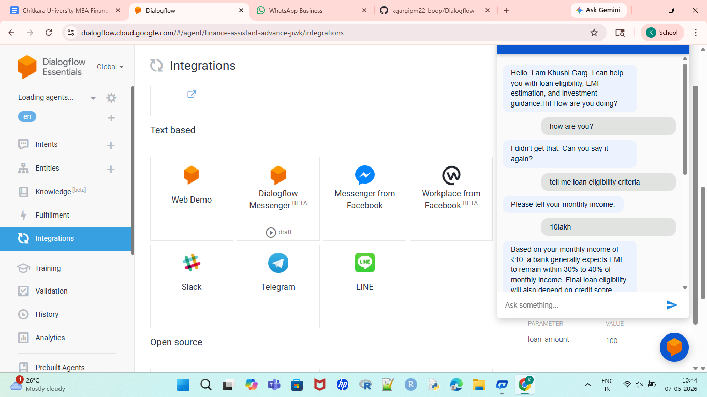
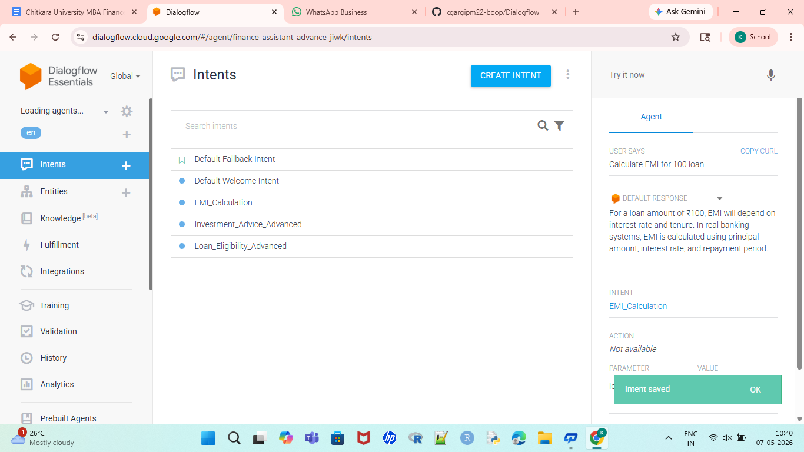
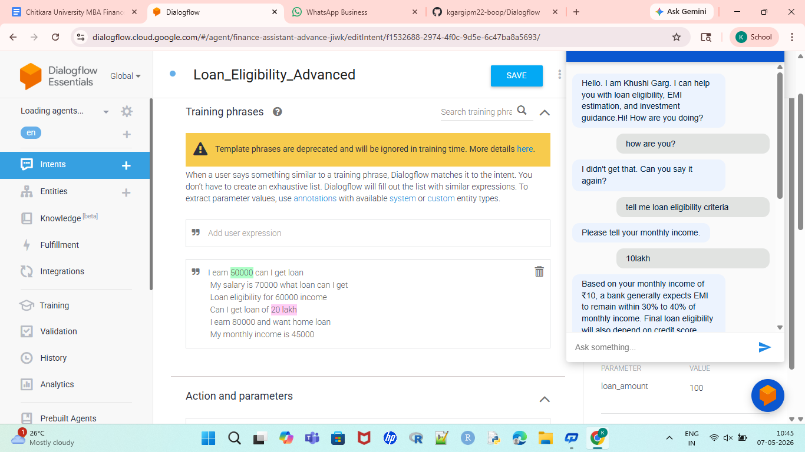
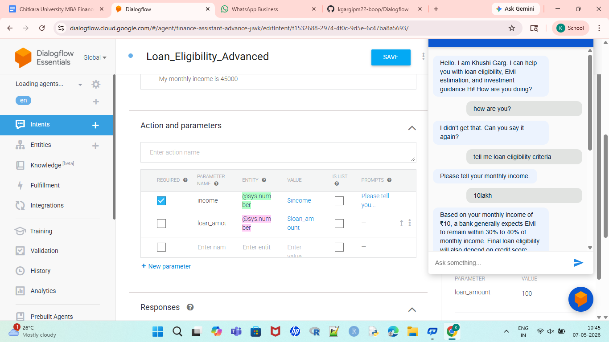
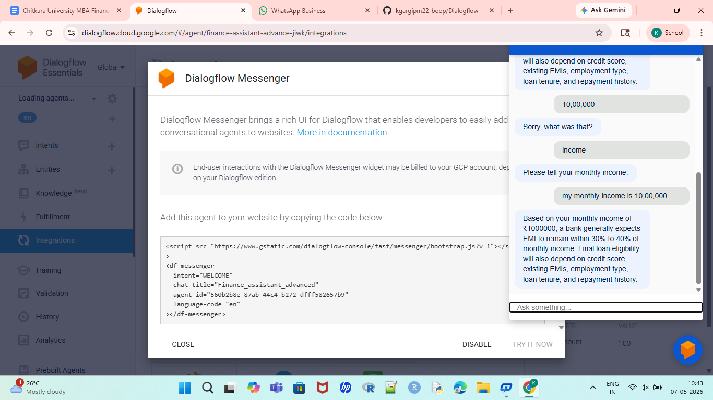

# 🤖 Dialogflow Chatbot Project

This repository contains my work and learning related to **Dialogflow** and chatbot development. The project includes screenshots, setup files, and resources used during the development process.

## 📌 About the Project

Dialogflow is a conversational AI platform by Google that helps developers create chatbots and virtual assistants. This repository is created to:

* Learn chatbot development
* Understand Dialogflow concepts
* Store project screenshots and resources
* Practice conversational flow design

## 📸 Screenshots

### 1. DIALOGFLOW

---

### 2. INTENT

### 3. TRAINING PHRASES

---

### 4. PARAMETERS

### 5. CHATBOTS

## 🚀 Features

* Chatbot workflow design
* Conversational AI learning
* Dialogflow practice project
* User interaction flow examples

## 🛠️ Technologies Used

* Dialogflow
* GitHub
* Conversational AI

## 📖 Learning Outcomes

Through this project, I learned:

* Basics of chatbot development
* Intent and entity creation in Dialogflow
* Conversation flow management
* GitHub repository management

## 📜 License

This project is licensed under the MIT License.

## 👤 Author

**Khushi Garg**

GitHub: kgarigpm22-boop
